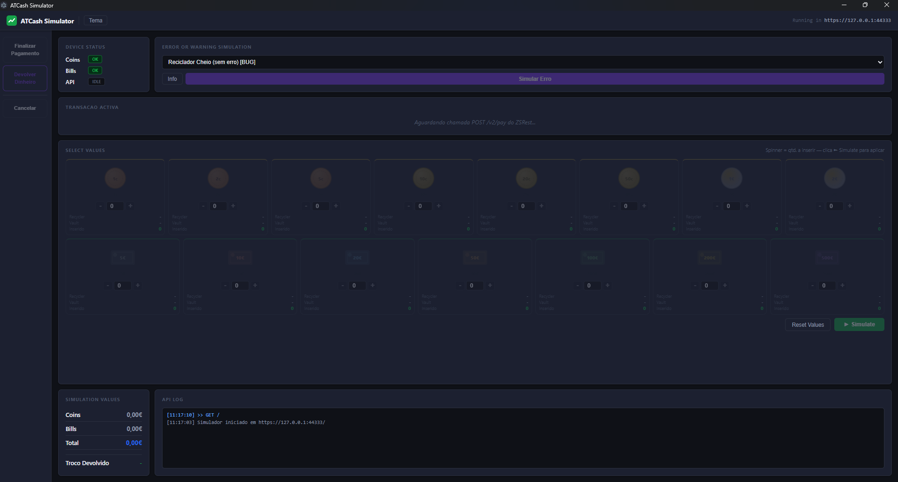

# ATCash Simulator

Simulador desktop da máquina de dinheiro ATCash, desenvolvido para simular o comportamento do equipamento físico ATCash.

---

## Screenshot



---

## Tecnologia

| Camada | Tecnologia |
|---|---|
| Servidor REST | Node.js (HTTPS, porta 44333) |
| Interface | HTML/CSS/JS gerado inline |
| Desktop | Electron (janela nativa Windows) |
| Certificado SSL | Auto-gerado via OpenSSL (Git for Windows) |
| Build/Distribuição | electron-builder (portable exe) |

---

## Distribuição

Para usar o simulador em outro computador, copiar os 3 arquivos juntos:

```
ATCashSimulator.exe
cert.pem
key.pem
```

> Os arquivos `cert.pem` e `key.pem` são gerados automaticamente na primeira execução, na mesma pasta do executável, desde que o Git for Windows esteja instalado. Se já existirem, são reutilizados.

---

## Interface

A janela abre maximizada com o seguinte layout:

```
+-------------------------------------------------------------+
|  ATCash Simulator   [Tema]       Running in https://...     |
+----------+--------------------------------------------------+
|          |  DEVICE STATUS  |  ERROR OR WARNING SIMULATION   |
| Sidebar  +--------------------------------------------------+
| (acoes)  |  TRANSACAO ACTIVA                                |
|          +--------------------------------------------------+
|          |  SELECT VALUES                                   |
|          +-----------------+--------------------------------+
|          | SIMULATION      |  API LOG                       |
|          | VALUES          |                                |
+----------+-----------------+--------------------------------+
```

### Header

- **Tema** — alterna entre tema claro e escuro
- **Running in https://127.0.0.1:44333** — endereço do servidor simulado

### Sidebar — Ações

| Botão | Quando disponível | Função |
|---|---|---|
| **Finalizar Pagamento** | Transação ativa | Conclui como `COMPLETED` com troco calculado |
| **Devolver Dinheiro** | Transação ativa | Aplica o cenário de erro selecionado (`COMPLETED_WITH_ERRORS`) |
| **Cancelar** | Transação ativa | Cancela a operação em curso |

### Device Status

Indicadores do estado dos subsistemas simulados:

| Campo | Descrição |
|---|---|
| **Coins** | Estado do aceitador de moedas (OK / ERR) |
| **Bills** | Estado do aceitador de notas (OK / ERR) |
| **API** | Estado da API (IDLE / IN USE) |

### Error or Warning Simulation

Permite configurar o comportamento do botão **Devolver Dinheiro**:

| Botão | Função |
|---|---|
| **Dropdown** | Seleciona o cenário de erro a simular |
| **Info** | Exibe detalhes do cenário selecionado |
| **Simular Erro** | Aplica o cenário e retorna `COMPLETED_WITH_ERRORS` |

#### Cenários disponíveis

| Cenário | Resposta da API |
|---|---|
| Reciclador Cheio (sem erro) | `errors=[]` |
| Reciclador Cheio (DeviceIsFull) | `errors=["DeviceIsFull"]` |
| Cashbox Cheia | `errors=["CashboxIsFull"]` |
| Sem Dinheiro (Hopper) | `errors=["HopperNotEnoughMoney"]` |
| Sem Troco Exato | `errors=["NOTEXACTMONEY"]` |
| Hopper Encravado | `errors=["HopperJammed"]` |
| NV Encravado | `errors=["NVJammed"]` |
| Bloqueada pelo Admin | `errors=["MachineLockedByAdmin"]` |
| Op. Incompleta | `errors=["ImcompleteOperation"]` |

### Transação Activa

Exibe os dados da operação em andamento:

- **Status** — `STARTED` / `COMPLETED` / `COMPLETED_WITH_ERRORS`
- **Pedido** — valor solicitado pelo sistema integrado
- **Entregue** — valor inserido pelo operador (via botões de denominação)
- **Troco** — diferença calculada automaticamente

Quando não há transação ativa exibe: *"Aguardando chamada POST /v2/pay..."*

### SELECT VALUES — Inserção de denominações

Grade de denominações com controles **−** e **+** por unidade, quantidade inserida e totais acumulados:

**Moedas:** 1c · 2c · 5c · 10c · 20c · 50c · 1€ · 2€  
**Notas:** 5€ · 10€ · 20€ · 50€ · 100€ · 200€ · 500€

| Botão | Função |
|---|---|
| **+** / **−** | Adiciona ou remove unidades de uma denominação |
| **Reset Values** | Zera todas as denominações |
| **Simulate** | Confirma os valores inseridos na transação |

### Simulation Values

Painel de monitoramento em tempo real:

| Campo | Descrição |
|---|---|
| **Coins** | Total em moedas inseridas |
| **Bills** | Total em notas inseridas |
| **Total** | Soma de moedas + notas |
| **Troco Devolvido** | Valor do troco da última operação `COMPLETED` |

> Os valores são resetados para `—` ao início de cada nova operação.

### API Log

Exibe as últimas chamadas REST recebidas com timestamp, endpoint e payload resumido (máximo 300 entradas).

---

## Fluxo de uso

### Pagamento com sucesso (troco)

1. O sistema integrado inicia uma operação — o campo **Pedido** é preenchido na Transação Activa
2. Usar os botões **+** nas denominações para compor o valor entregue
3. Clicar em **Simulate** para confirmar os valores
4. Clicar em **Finalizar Pagamento**
5. O simulador retorna `COMPLETED` com `totalInput` = valor entregue
6. O sistema integrado calcula e exibe o troco (`Entregue − Pedido`)

### Simulação de erro

1. Iniciar uma operação de pagamento normalmente
2. Selecionar o cenário desejado no dropdown **Error or Warning Simulation**
3. Clicar em **Simular Erro** ou em **Devolver Dinheiro** na sidebar
4. O simulador retorna `COMPLETED_WITH_ERRORS` com os erros do cenário

> **Atenção:** No equipamento real, a finalização é automática assim que o valor pedido é atingido. No simulador é necessário clicar em **Finalizar Pagamento** manualmente.

---

## API REST simulada

O simulador expõe os endpoints da ATCash REST API v2 em `https://127.0.0.1:44333`:

| Método | Endpoint | Descrição |
|---|---|---|
| GET | `/v2/heartbeat` | Health check |
| POST | `/v2/payment/start` | Inicia pagamento |
| GET | `/v2/payment/status/{uuid}` | Consulta status |
| POST | `/v2/payment/finalize/{uuid}` | Finaliza manualmente |
| POST | `/v2/payment/cancel/{uuid}` | Cancela operação |
| GET | `/v2/levels` | Retorna níveis de cédulas/moedas |
| GET | `/` | Interface web |

SSL auto-assinado — o cliente deve ignorar erros de certificado.

---

## Build

```bash
npm install
npm run dist
```

Gera: `dist/ATCashSimulator.exe` (portable, sem instalação)

> Requer Node.js e npm instalados.
